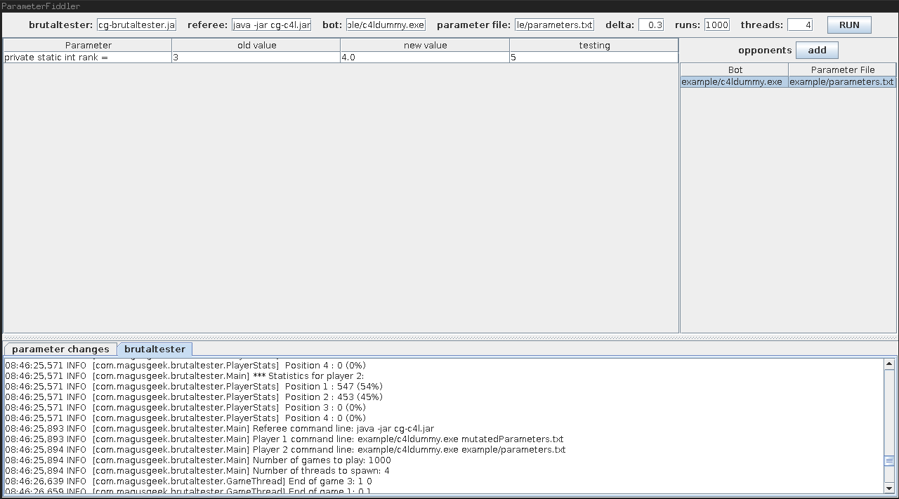

# Preparations:
* get the brutaltester and a referee.
* write the parameters you want to change to a textfile
* modify your bot to read from a textfile given as command line argument

# Parameter file
You can most likely copy these lines of code, where you define the parameters.
Numbers are detected by the regex `(?<![\w_\-])\d+(\.?\d*)?(e\-?\d+)?`.
If they contain a `:`, `float`, `double`, they are treated as doubles, as integer otherwise.

# Running the fiddler

## Command line
Assuming that all files are in the same folder, you can start the program as follows:
`java -jar ParameterFiddler.jar -brutaltester cg-brutaltester.jar -r "java -jar cg-c4l.jar" -bot "./c4ldummy.exe:parameters.txt" -opponents "./c4ldummy.exe:parameters.txt" -n1000 -t4`
First, brutaltester and referee are passed.
Then the `-bot` to optimize is specified. In that case c4ldummy.exe, reading from parameters.txt.
As opponent, the same command is used, meaning that the bot fights itself.
This is done on 4 threads, with 1000 rounds.
Additionally you can define a `-delta` to chose how much a parameter can change in a sinlge run (default is 0.3).

The sample bot plays code4life, but isn't very smart.
Initially it starts with rank1 samples, but later on takes rank2 instead.
However starting with rank2 at only 3 expertise is a bit early.
So the parameter fiddler should increase that value to about 9 or 10 when running for some minutes.

## GUI
Start the fiddler with `java -jar ParameterFiddler.jar -gui`, there is no need to pass the bots and referee via command line.

